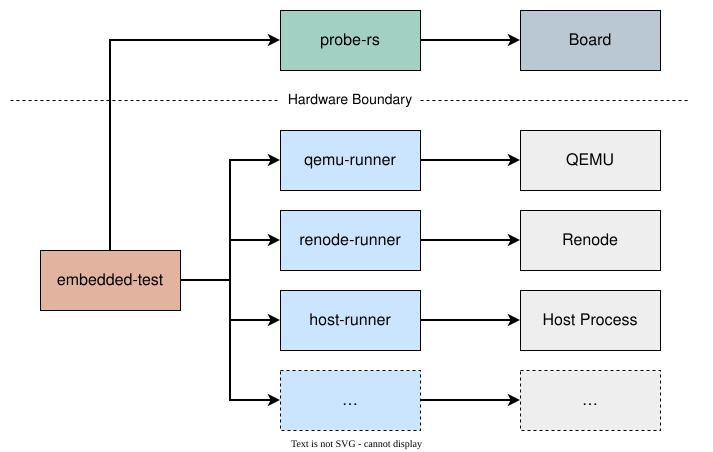

# embedded-test-runner

[](https://github.com/jj-libre/embedded-test-runner/actions/workflows/ci.yml)

Cargo runners that execute [`embedded-test`](https://github.com/probe-rs/embedded-test)
suites without a probe.



## Crates

### Runners

| Crate | |
|---|---|
| [`embedded-test-qemu-runner`](embedded-test-qemu-runner/) | Runs tests under [QEMU](https://www.qemu.org) |
| [`embedded-test-renode-runner`](embedded-test-renode-runner/) | Runs tests under [Renode](https://renode.io) |
| [`embedded-test-host-runner`](embedded-test-host-runner/) | Runs tests as native host processes |

### Internal

| Crate | |
|---|---|
| [`embedded-test-runner-core`](embedded-test-runner-core/) | Shared library the runners are built on |

### Utils

| Crate | |
|---|---|
| [`xtask`](xtask/) | Repository tasks |
| [`test-util`](test-util/) | Testing utilities |

## Development

```bash
cargo test                   # host tests
cargo xtask examples test    # every example through its runner
cargo xtask examples sync    # rewrite what the examples of a venue share
```

## Licence

MIT OR Apache-2.0.
