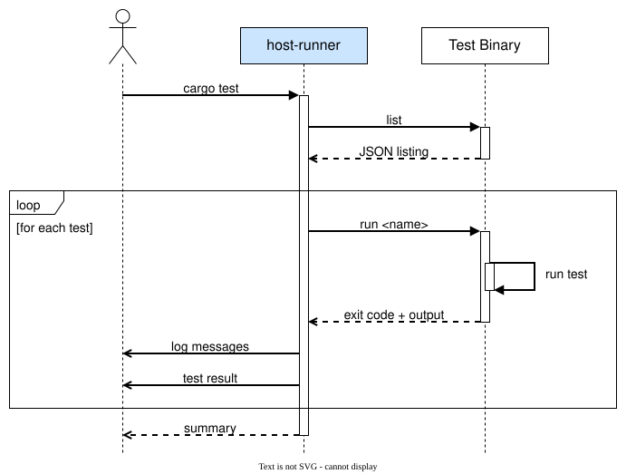

# embedded-test-host-runner

[](https://crates.io/crates/embedded-test-host-runner)
[](https://github.com/jj-libre/embedded-test-runner/actions/workflows/ci.yml)

A Cargo runner that executes [`embedded-test`](https://github.com/probe-rs/embedded-test)
suites as native host processes.

## Install

```bash
cargo install embedded-test-host-runner          # from crates.io
cargo install --path embedded-test-host-runner   # from a checkout of this repo
```

## Use

The suite must be built against embedded-test with the `std` feature, which
swaps semihosting for ordinary process arguments and exit codes.

```toml
# Cargo.toml
[dev-dependencies]
embedded-test = { version = "0.7", default-features = false, features = ["std"] }
```

```toml
# .cargo/config.toml
[target.'cfg(all())']
runner = "embedded-test-host-runner --timeout 10"
```

```bash
cargo test
```

Spell the runner as a string. An editor's debug integration overrides
`cfg(all())`'s runner with one, and cargo refuses to merge a string into an
array.

### Flags

| Flag | Meaning | Default |
|---|---|---|
| `--timeout <SECS>` | Per-test timeout, overridable with `#[timeout(N)]` | `10` |
| `--verbose` | Print the discovered tests and each invocation | off |
| `--debug` | Name the one test a selection resolves to, and run nothing | off |

### Exit codes

| Code | |
|---|---|
| `0` | all tests passed |
| `1` | tests failed |
| `2` | the runner failed |

### Debugging a test

The test binary is native, so a debugger launches it directly. The
[std example](examples/std/) ships a CodeLLDB `launch.json` for it.

`--debug` names the test a selection resolves to, and refuses an ambiguous one:

```bash
EMBEDDED_TEST_DEBUG=true cargo test --test smoke -- tests::arithmetic
waiting for a debugger to run tests::arithmetic_holds
```

## Windows

The MSVC linker ignores `embedded-test.x`, leaving
`embedded_test_linker_file_not_added_to_rustflags` and `_embedded_test_setup`
unresolved. Alias them instead:

```rust
// build.rs
println!("cargo::rustc-link-arg=/ALTERNATENAME:embedded_test_linker_file_not_added_to_rustflags=__embedded_test_start");
println!("cargo::rustc-link-arg=/ALTERNATENAME:_embedded_test_setup=__embedded_test_default_setup");
```

## Protocol



## Examples

- [std](examples/std/)

## Use alongside hardware

```rust
#![cfg_attr(target_os = "none", no_std)]
#![no_main]
```

```toml
# Cargo.toml
[target.'cfg(target_os = "none")'.dev-dependencies]
embedded-test = "0.7"

[target.'cfg(not(target_os = "none"))'.dev-dependencies]
embedded-test = { version = "0.7", default-features = false, features = ["std"] }
```

## Licence

MIT OR Apache-2.0.
