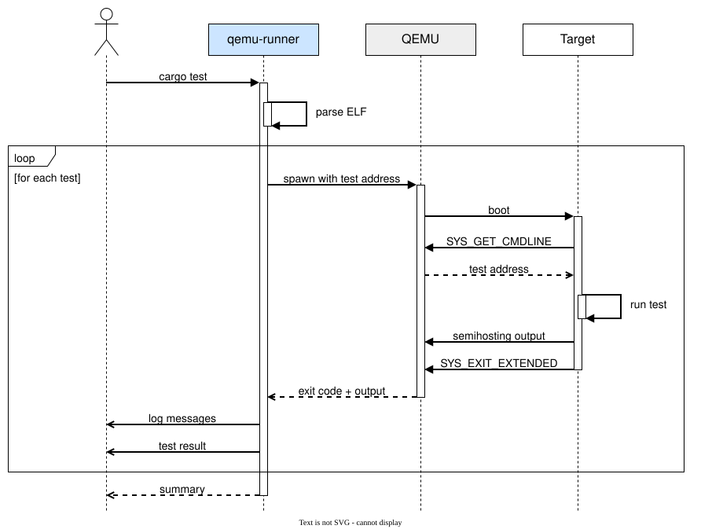

# embedded-test-qemu-runner

[](https://crates.io/crates/embedded-test-qemu-runner)
[](https://github.com/jj-libre/embedded-test-runner/actions/workflows/ci.yml)

A Cargo runner that executes [`embedded-test`](https://github.com/probe-rs/embedded-test)
suites inside QEMU.

## Install

```bash
cargo install embedded-test-qemu-runner          # from crates.io
cargo install --path embedded-test-qemu-runner   # from a checkout of this repo
```

QEMU: <https://www.qemu.org/download/>.

## Use

```toml
# .cargo/config.toml
[target.thumbv7m-none-eabi]
runner = [
  "embedded-test-qemu-runner",
  "--qemu", "qemu-system-arm -cpu cortex-m3 -machine lm3s6965evb -nographic",
  "--timeout", "10",
]
```

```bash
cargo test --target thumbv7m-none-eabi
```

### Flags

| Flag | Meaning | Default |
|---|---|---|
| `--qemu <COMMAND>` | QEMU binary plus its board arguments, shell-quoted | required |
| `--timeout <SECS>` | Per-test timeout, overridable with `#[timeout(N)]` | `10` |
| `--verbose` | Print the discovered tests and each QEMU invocation | off |
| `--debug` | Run one test and hold it for a debugger | off |
| `--gdb <PORT>` | Port the GDB stub is served on, required by `--debug` | off |

`--qemu` describes the board. The runner appends `-kernel` and
`-semihosting-config` itself, and `-gdb`/`-S` under `--gdb`, so a `--qemu`
containing any of them is rejected.

### Exit codes

| Code | |
|---|---|
| `0` | all tests passed |
| `1` | tests failed |
| `2` | the runner failed |

### Debugging a test

`--debug` starts QEMU with the guest halted and `--gdb <PORT>` says where the
stub is served, so a debugger can attach and step through the test. They read
`EMBEDDED_TEST_DEBUG` and `EMBEDDED_TEST_GDB`, which is how an editor switches
debugging on without a second runner configuration:

```bash
EMBEDDED_TEST_DEBUG=true EMBEDDED_TEST_GDB=3333 \
    cargo test --test smoke -- --exact tests::arithmetic_holds
```

The two are refused apart: a port with nothing to hold for it serves a stub
nobody connects to, and a debug run without one has nowhere to serve.

Each test is a separate run of the binary, so a debug run takes exactly one test
and refuses any other number. The per-test timeout does not apply. The
[examples](examples/) ship a CodeLLDB `launch.json`.

## Protocol



## Examples

- [cortex-m](examples/cortex-m/)
- [aarch32](examples/aarch32/)
- [aarch64](examples/aarch64/)
- [rv32](examples/rv32/)
- [rv64](examples/rv64/)

## Use alongside hardware

```toml
# .cargo/config.toml
[target.thumbv7m-none-eabi]
runner = "probe-rs run --chip STM32F103RBTx"
```

```bash
cargo test --config \
  "target.thumbv7m-none-eabi.runner='embedded-test-qemu-runner \
  --qemu \"qemu-system-arm -cpu cortex-m3 -machine lm3s6965evb -nographic\"'"
```

## Licence

MIT OR Apache-2.0.
