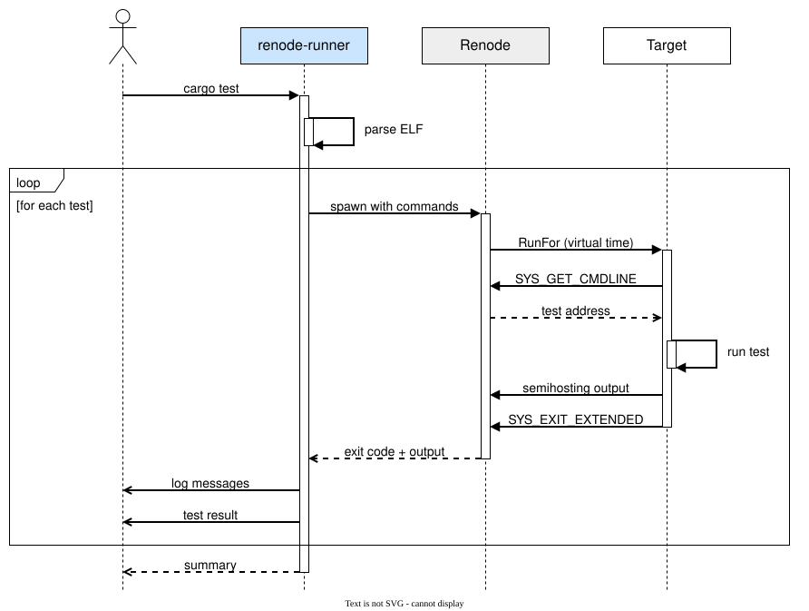

# embedded-test-renode-runner

[](https://crates.io/crates/embedded-test-renode-runner)
[](https://github.com/jj-libre/embedded-test-runner/actions/workflows/ci.yml)

A Cargo runner that executes [`embedded-test`](https://github.com/probe-rs/embedded-test)
suites inside [Renode](https://renode.io).

## Install

```bash
cargo install embedded-test-renode-runner          # from crates.io
cargo install --path embedded-test-renode-runner   # from a checkout of this repo
```

Renode must be a **nightly** build from <https://builds.renode.io>. Semihosting
needs `CPU.SemihostingHandler`, which landed after release 1.16.1; on 1.16.1 the
run fails with `Error E04: Could not resolve type: 'CPU.SemihostingHandler'`.
Nightlies also report their version as `1.16.1`, so pin the dated filename.

## Use

```toml
# .cargo/config.toml
[target.thumbv7m-none-eabi]
runner = [
  "embedded-test-renode-runner",
  "--platform", "cortex-m.repl",
  "--timeout", "10",
]
```

```bash
cargo test --target thumbv7m-none-eabi
```

### Flags

| Flag | Meaning | Default |
|---|---|---|
| `--platform <FILE>` | Platform description for the board | required |
| `--script <FILE>` | Extra `.resc`, run after the platform and before the ELF | none |
| `--renode <PATH>` | Renode executable, or the `RENODE` environment variable | `renode` |
| `--cpu <NAME>` | Name of the CPU in the platform description | `cpu` |
| `--timeout <SECS>` | Per-test bound in **virtual** seconds, overridable with `#[timeout(N)]` | `10` |
| `--wall-timeout <SECS>` | Wall-clock bound on Renode itself | `120` |
| `--debug` | Run one test and hold it for a debugger | off |
| `--gdb <PORT>` | Port the GDB stub is served on, required by `--debug` | off |
| `--verbose` | Print the discovered tests and each monitor command | off |

`--timeout` is virtual time, enforced by Renode's `RunFor`, so it does not
depend on host speed. `--wall-timeout` only catches Renode getting stuck; raise
it for suites with a large virtual budget.

`--cpu` is needed because the runner addresses the semihosting handler by name
(`cpu.semihosting …`) to pass the test address in and read the result back. Most
platforms name the CPU `cpu`; SMP platforms usually use `cpu0`.

### Exit codes

| Code | |
|---|---|
| `0` | all tests passed |
| `1` | tests failed |
| `2` | the runner failed |

### Debugging a test

`--debug` holds the guest at its reset vector and `--gdb <PORT>` says where the
stub is served, so a debugger can attach and step through the test. They read
`EMBEDDED_TEST_DEBUG` and `EMBEDDED_TEST_GDB`, which is how an editor switches
debugging on without a second runner configuration:

```bash
EMBEDDED_TEST_DEBUG=true EMBEDDED_TEST_GDB=3333 \
    cargo test --test smoke -- --exact tests::arithmetic_holds
```

The two are refused apart: a port with nothing to hold for it serves a stub
nobody connects to, and a debug run without one has nowhere to serve.

Each test is a separate run of the binary, so a debug run takes exactly one test
and refuses any other number. `--wall-timeout` does not apply. `--timeout` still
does, and costs nothing to sit at a breakpoint: virtual time stops while the
guest is halted, so only instructions the guest actually executes spend the
budget. The [examples](examples/) ship a CodeLLDB `launch.json`.

## Platform description

The board needs a CPU, memory, and the semihosting handler:

```
cpu: CPU.CortexM @ sysbus
    cpuType: "cortex-m3"
    nvic: nvic

semihosting: CPU.SemihostingHandler @ cpu
```

> [!WARNING]
> Renode starts the CPU at its architectural reset address, not at the ELF entry
> point, so the vector table must be linked there and backed by memory.
> Otherwise the CPU runs from unmapped memory and Renode grows until it reports
> `Out of memory`.

## Protocol



## Examples

- [cortex-m](examples/cortex-m/)
- [aarch32](examples/aarch32/)

## Use alongside hardware

```toml
# .cargo/config.toml
[target.thumbv7m-none-eabi]
runner = "probe-rs run --chip STM32F103RBTx"
```

```bash
cargo test --config \
  "target.thumbv7m-none-eabi.runner='embedded-test-renode-runner \
  --platform cortex-m.repl'"
```

## Licence

MIT OR Apache-2.0.
